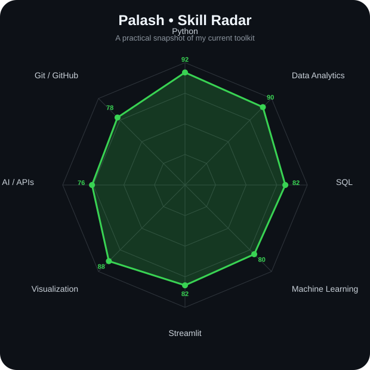
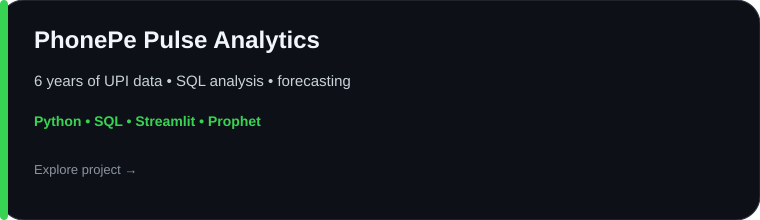
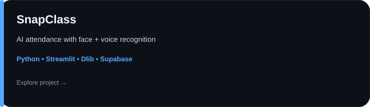
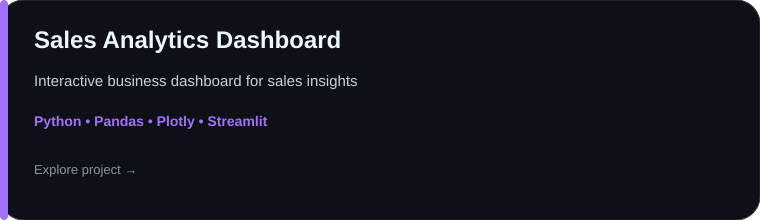
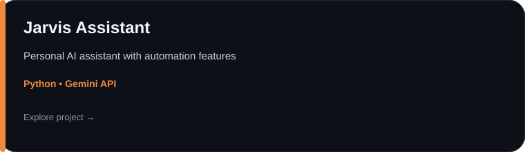

<div align="center">


<br>

# `~/` Palash Halder

### Data Analyst • Machine Learning • AI Builder

I turn messy data into useful decisions, then build the dashboards and tools that make those decisions easy to act on.

<br>

<a href="https://github.com/Palash1249">
  
</a>

<br><br>

<a href="https://www.linkedin.com/in/palashhalder07/"></a> <a href="https://github.com/Palash1249"></a> <a href="https://phonepe-pulse-analysis.onrender.com/"></a>

<br><br>


</div>

---

## `~/` whoami

```console
$ cat about.txt
```

I'm **Palash Halder**, a final-year Computer Science student focused on **data analytics, machine learning, and practical AI applications**.

* 🎯 Currently targeting **Data Analyst / Data Science opportunities**
* 🤖 Long-term direction: **Machine Learning / AI Engineering**
* 📊 I enjoy turning raw datasets into dashboards, forecasts, and business insights
* 🧠 Research experience with **XGBoost, GNNs and VAEs**
* 🛠️ Comfortable moving across the pipeline: **SQL → Python → analysis → ML → Streamlit**
* 🚀 Currently building projects that combine analytics with useful AI features

> **My approach:** understand the problem first, clean the data properly, build a useful model, and ship something people can actually use.

---

## `~/` toolbox

<div align="center">


<br><br>


<br><br>

**Analytics:** `Pandas` `NumPy` `SQL` `Matplotlib` `Seaborn` `Plotly`
**ML / AI:** `Scikit-learn` `XGBoost` `Prophet` `Computer Vision` `Gemini API`
**Apps:** `Streamlit` `Flask` `Supabase`
**Workflow:** `Git` `GitHub` `Jupyter` `VS Code`

</div>

---

## `~/` skill radar

<div align="center">



</div>

> These are intentionally editable self-ratings, not claims of certification or expertise. Update `assets/skill-radar.svg` as your skills grow.

---

## `~/` contribution activity

<div align="center">

<picture>
  <source media="(prefers-color-scheme: dark)" srcset="https://raw.githubusercontent.com/Palash1249/Palash1249/output/github-contribution-grid-snake-dark.svg">
  <source media="(prefers-color-scheme: light)" srcset="https://raw.githubusercontent.com/Palash1249/Palash1249/output/github-contribution-grid-snake.svg">
  
</picture>

</div>

---

## `~/` the numbers

<div align="center">


<br><br>


</div>

---

## `~/` selected work

### 📱 PhonePe Pulse Analytics

<a href="https://github.com/Palash1249/phonepe-pulse-analysis">

</a>

End-to-end UPI analytics using six years of transaction data, business-focused SQL, an interactive Streamlit dashboard and Prophet forecasting.

**Live:** https://phonepe-pulse-analysis.onrender.com/

---

### 🎓 SnapClass — AI Attendance Monitor

<a href="https://github.com/Palash1249/AI-Intelegent-Attendence-Monitor">

</a>

AI-powered attendance management combining face recognition, voice recognition, Streamlit and Supabase. Includes separate student and teacher workflows.

**Live App:** https://snapclass-palashmain.streamlit.app/
**Landing Page:** https://snap-class-landing-page-fawn.vercel.app/

---

### 📈 Sales Analytics Dashboard

<a href="https://github.com/Palash1249/Sales-Analytics-Dashboard">

</a>

An interactive sales analytics project focused on turning business data into clear KPIs, trends and actionable insights.

**Live:** https://sales-analytics-dashboard-4btmmhzegqyjb3f7gndgq4.streamlit.app/

---

### 🤖 Jarvis Assistant

<a href="https://github.com/Palash1249/Jarvis-Assistant">

</a>

A Python-based personal AI assistant exploring natural-language interaction and API-driven automation.

---

### 🏠 House Price Prediction

<a href="https://github.com/Palash1249/PRODIGY_ML_01">

</a>

A machine-learning project using housing features such as living area, bedrooms and bathrooms to predict house prices.

---

## `~/` current direction

```text
DATA
 ├── clean
 ├── explore
 ├── visualize
 └── explain

MACHINE LEARNING
 ├── baseline
 ├── validate
 ├── forecast
 └── deploy

AI
 ├── APIs
 ├── automation
 ├── computer vision
 └── useful interfaces
```

I'm especially interested in projects where **analytics, ML and software meet** — not just training a model, but turning the result into something understandable and usable.

---

<div align="center">

### `01100100 01100001 01110100 01100001 00100000 01100100 01110010 01101001 01110110 01100101 01101110`

**Thanks for stopping by.**

<sub>Build • Analyse • Learn • Repeat</sub>

</div>
